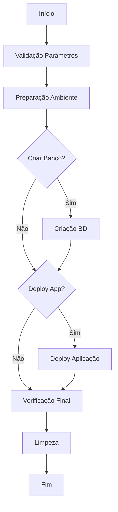

# Pipeline de Criação de Ambiente

Este projeto contém um pipeline Jenkins para automatizar a criação de ambientes de banco de dados e deploy de aplicações, baseado na lógica original do Ansible.

## 📋 Estrutura do Projeto

```
pipelineCriarAmbiente/
├── Jenkinsfile                 # Pipeline principal
├── README.md                   # Esta documentação
├── config/
│   └── environments.yaml       # Configurações de ambientes
├── scripts/
│   ├── get_db_host.sh         # Mapeia servidor para host DB
│   ├── create_database.sh     # Script principal de criação
│   ├── generate_start_sql.sh  # Gera SQL personalizado
│   ├── deploy_application.sh  # Deploy de aplicação WAR
│   ├── verify_database.sh     # Verificação do banco
│   └── verify_deployment.sh   # Verificação do deploy
├── templates/
│   └── (templates de configuração)
├── sql/
│   ├── ptf/
│   │   ├── config.sql
│   │   ├── credentials.sql
│   │   └── updates/
│   └── pln/
│       ├── credentials.sql
│       └── updates/
└── dados/
    ├── ptf/
    │   └── dados.txt
    └── pln/
        └── dados.txt
```

## 🚀 Como Usar

### 1. Configuração no Jenkins

1. **Criar novo Job Pipeline**:
   - Novo Item → Pipeline
   - Nome: `criar-ambiente`

2. **Configurar Pipeline**:
   - Pipeline → Definition: `Pipeline script from SCM`
   - Repository URL: `seu-repositorio`
   - Script Path: `scripts/pipelineCriarAmbiente/Jenkinsfile`

3. **Configurar Credenciais**:
   ```bash
   # No Jenkins: Manage Jenkins → Credentials
   - db-pathfind-user: usuário do banco
   - db-pathfind-password: senha do banco
   ```

### 2. Parâmetros do Pipeline

| Parâmetro | Tipo | Descrição | Exemplo |
|-----------|------|-----------|----------|
| `TIPO_AMBIENTE` | Choice | Tipo do ambiente | `ptf` ou `pln` |
| `SERVIDOR` | Choice | Servidor de destino | `gcp01`, `gcp02`, `local01` |
| `NOME_BANCO` | String | Nome do banco | `meu_projeto_teste` |
| `VERSAO_DESEJADA` | String | Versão alvo | `15.13.1.0-1` |
| `WAR_FILE_PATH` | String | Caminho do WAR | `/path/to/app.war` |
| `DEPLOY_PATH` | String | Caminho de deploy | `/opt/applications` |
| `CRIAR_BANCO` | Boolean | Executar criação BD | `true`/`false` |
| `DEPLOY_APP` | Boolean | Executar deploy app | `true`/`false` |

### 3. Exemplo de Execução

**Apenas Criar Banco:**
```
TIPO_AMBIENTE: ptf
SERVIDOR: gcp01
NOME_BANCO: projeto_teste
VERSAO_DESEJADA: 15.13.1.0-1
CRIAR_BANCO: true
DEPLOY_APP: false
```

**Criar Banco + Deploy:**
```
TIPO_AMBIENTE: ptf
SERVIDOR: gcp01
NOME_BANCO: projeto_teste
VERSAO_DESEJADA: 15.13.1.0-1
WAR_FILE_PATH: /jenkins/workspace/build-app/target/app.war
DEPLOY_PATH: /opt/applications
CRIAR_BANCO: true
DEPLOY_APP: true
```

## 🔧 Funcionalidades

### ✅ Criação de Banco de Dados
- Cria banco baseado em template específico do ambiente
- Processa dados personalizados do ambiente
- Executa configurações iniciais (start.sql)
- Aplica configurações do ambiente (config.sql)
- Executa updates incrementais até versão desejada
- Configura credenciais de usuários

### ✅ Deploy de Aplicação
- Extrai arquivo WAR
- Cria estrutura de diretórios
- Gera configuration personalizada
- Cria scripts de start/stop
- Configura logging

### ✅ Verificações
- Valida criação do banco
- Verifica conectividade
- Confirma estrutura da aplicação
- Testa configurações

## 📁 Configuração de Dados

### Arquivo de Dados do Ambiente
Crie `dados/{ambiente}/dados.txt`:
```
Endereço: Rua Exemplo, 123
Bairro: Centro
Cidade: São Paulo
Estado: SP
CEP: 01000-000
Lat: -23.5505
Long: -46.6333
CNPJ: 12.345.678/0001-99
Razão Social: Empresa Exemplo Ltda
```

### Scripts SQL
- `sql/{ambiente}/config.sql`: Configurações específicas do ambiente
- `sql/{ambiente}/credentials.sql`: Usuários e permissões
- `sql/{ambiente}/updates/`: Updates incrementais ordenados

## 🎯 Benefícios vs Ansible Original

| Aspecto | Pipeline Jenkins | Ansible Original |
|---------|------------------|------------------|
| **Integração** | Native Jenkins | Requer configuração |
| **Interface** | Web UI com parâmetros | CLI/Interface web |
| **Logs** | Jenkins artifacts | Logs próprios |
| **Escalabilidade** | Jenkins agents | Inventário Ansible |
| **Manutenção** | Scripts bash simples | Playbooks YAML |
| **Debugging** | Step-by-step Jenkins | Verbose Ansible |

## 🔄 Fluxo de Execução



## 🛠️ Troubleshooting

### Problemas Comuns

**1. Erro de Conexão com BD:**
```bash
# Verificar conectividade
telnet <db_host> 5432

# Testar credenciais
psql -h <db_host> -U <user> -d postgres
```

**2. WAR não Extrai:**
```bash
# Verificar se é arquivo WAR válido
file app.war

# Testar extração manual
jar -tf app.war | head -10
```

**3. Scripts sem Permissão:**
```bash
# Dar permissão de execução
chmod +x scripts/*.sh
```

### Logs Importantes
- Jenkins Console Output: Logs principais do pipeline
- `logs/`: Logs da aplicação deployada
- `/tmp/`: Arquivos temporários do processo

## 🔒 Segurança

- Credenciais armazenadas no Jenkins Credentials
- Arquivos temporários limpos automaticamente
- Logs não expõem senhas
- Scripts executam com usuário limitado

## 📈 Monitoramento

- Pipeline status via Jenkins
- Artifacts arquivados automaticamente
- Health checks pós-deployment
- Logs centralizados

---

**Autor:** Sistema de Automação  
**Versão:** 1.0  
**Data:** $(date +'%Y-%m-%d')